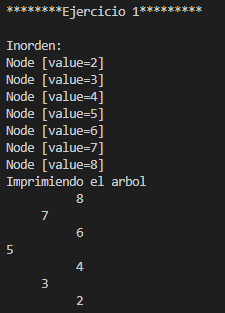
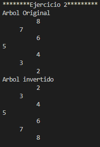
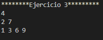
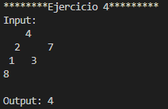

# Universidad Politécnica Salesiana
# Estructura de Datos

## Nombre:
Sebastián Alvarez

## Materia:
Estructura de Datos

## Fecha:
22/06/2026

## Profesor:
Pablo Torres

## Tema:
Implementación de Árboles Binarios en Java

# Introducción

Este proyecto reúne cuatro ejercicios desarrollados en Java con el objetivo de reforzar el manejo de árboles binarios. Durante la práctica se implementó una estructura de árbol binario de búsqueda utilizando las clases `Node` y `BinaryTree`, aplicando conceptos como recursividad, recorridos de árboles y manipulación de nodos.

Cada ejercicio aborda una operación diferente sobre el árbol, permitiendo comprender cómo insertar elementos, recorrer la estructura, invertir sus ramas, organizar la información por niveles y calcular su profundidad máxima.

---

# Ejercicio 1: Inserción e impresión del árbol

## Descripción

El primer ejercicio consiste en crear un árbol binario de búsqueda a partir de un arreglo de números enteros. Cada elemento es insertado utilizando el método `add()`, respetando las reglas de un BST. Finalmente, se realiza un recorrido inorden y se imprime el árbol de forma visual.

### Conceptos utilizados

- Árbol Binario de Búsqueda (BST)
- Clase `BinaryTree`
- Clase `Node`
- Recorrido Inorden
- Recursividad
- Impresión del árbol

### Explicación

Se crea un árbol vacío y posteriormente se recorren todos los valores del arreglo para agregarlos mediante el método `add()`. Una vez construido el árbol, se ejecuta el recorrido inorden, el cual muestra los datos ordenados de menor a mayor.

Además, se utiliza un método recursivo para imprimir la estructura del árbol en consola. Primero se muestra el subárbol derecho, luego el nodo actual y finalmente el subárbol izquierdo, permitiendo visualizar el árbol de forma lateral.

### Código

```java
package structures.trees;

import structures.node.Node;

public class Ejercicio1 {
    public void insert(int[] numeros) {
        BinaryTree<Integer> arbol = new BinaryTree<>();

        for (int numero : numeros) {
            arbol.add(numero);
        }

        System.out.println("\n------------Ejercicio 1-----------");
        System.out.println("\nInorden: ");
        arbol.inOrden();

        printTree(arbol.getRoot());
    }

    public void printTree(Node<Integer> root) {
        System.out.println("Imprimiendo el arbol");
        printTreeRecursivo(root, 0);
    }

    private void printTreeRecursivo(Node<Integer> actual, int nivel) {
        if (actual == null)
            return;

        printTreeRecursivo(actual.getRight(), nivel + 1);

        for (int i = 0; i < nivel; i++) {
            System.out.print("     ");
        }

        System.out.println(actual.getValue());
        printTreeRecursivo(actual.getLeft(), nivel + 1);
    }
}
``` 

### Resultado



# Ejercicio 2: Inversión del árbol binario

## Descripción

En este ejercicio se modifica el árbol para intercambiar los hijos izquierdo y derecho de cada nodo. Antes y después del proceso se imprime la estructura para observar los cambios realizados.

### Conceptos utilizados

- Clase `Node`
- Recursividad
- Intercambio de referencias
- Árbol Binario
- Impresión del árbol

### Explicación

El algoritmo recorre cada nodo del árbol utilizando recursividad. En cada llamada se guarda temporalmente el hijo izquierdo, luego se intercambian las referencias de ambos hijos y posteriormente el mismo procedimiento continúa sobre los subárboles restantes.

Al finalizar el recorrido, toda la estructura del árbol queda invertida.

### Código

```java
package structures.trees;

import structures.node.Node;

public class Ejercicio2 {
    public void invertTree(Node<Integer> root) {
        System.out.println("\n------------Ejercicio 2-----------");

        System.out.println("Arbol Original");
        printTree(root);

        invertirRecursivo(root);

        System.out.println("Arbol invertido");
        printTree(root);
    }

    private void invertirRecursivo(Node<Integer> actual) {
        if (actual == null)
            return;

        Node<Integer> x = actual.getLeft();

        actual.setLeft(actual.getRight());
        actual.setRight(x);

        invertirRecursivo(actual.getLeft());
        invertirRecursivo(actual.getRight());
    }

    public void printTree(Node<Integer> root) {
        printTreeRecursivo(root, 0);
    }

    private void printTreeRecursivo(Node<Integer> actual, int nivel) {
        if (actual == null)
            return;

        printTreeRecursivo(actual.getRight(), nivel + 1);

        for (int i = 0; i < nivel; i++)
            System.out.print("     ");

        System.out.println(actual.getValue());

        printTreeRecursivo(actual.getLeft(), nivel + 1);
    }
}
```

### Resultado



# Ejercicio 3: Recorrido por niveles

## Descripción

El objetivo de este ejercicio es obtener los nodos del árbol agrupados según el nivel al que pertenecen. Para lograrlo se implementa un recorrido por niveles utilizando una cola.

### Conceptos utilizados

- Queue
- LinkedList
- ArrayList
- Recorrido BFS
- Estructura FIFO

### Explicación

Se crea una cola donde inicialmente se almacena la raíz del árbol. Mientras existan nodos pendientes, se procesa un nivel completo, agregando sus hijos a la cola para recorrerlos posteriormente.

Cada nivel se almacena en una lista independiente, obteniendo finalmente una colección donde cada posición representa un nivel diferente del árbol.

### Código

```java
package structures.trees;

import java.util.ArrayList;
import java.util.LinkedList;
import java.util.List;
import java.util.Queue;
import structures.node.Node;

public class Ejercicio3 {

    public List<List<Node<Integer>>> listLevels(Node<Integer> root) {
        List<List<Node<Integer>>> niveles = new ArrayList<>();

        if (root == null) {
            return niveles;
        }

        Queue<Node<Integer>> cola = new LinkedList<>();
        cola.add(root);

        while (!cola.isEmpty()) {
            int cantidadNivel = cola.size();
            List<Node<Integer>> nivelActual = new LinkedList<>();

            for (int i = 0; i < cantidadNivel; i++) {
                Node<Integer> actual = cola.poll();

                nivelActual.add(actual);

                if (actual.getLeft() != null) {
                    cola.add(actual.getLeft());
                }

                if (actual.getRight() != null) {
                    cola.add(actual.getRight());
                }
            }

            niveles.add(nivelActual);
        }

        return niveles;
    }
}
```

### Resultado



# Ejercicio 4: Profundidad máxima

## Descripción

En este ejercicio se calcula la cantidad máxima de niveles existentes en un árbol binario, tomando como referencia el camino más largo desde la raíz hasta una hoja.

### Conceptos utilizados

- Recursividad
- Método `maxDepth`
- Math.max()
- Árbol Binario

### Explicación

El algoritmo analiza de forma recursiva la profundidad del subárbol izquierdo y del subárbol derecho. Luego compara ambos resultados utilizando `Math.max()` y suma una unidad correspondiente al nodo actual.

El valor retornado representa la profundidad máxima del árbol.

### Código

```java
package structures.trees;

import structures.node.Node;

public class Ejercicio4 {

    public int maxDepth(Node<Integer> root) {
        if (root == null) {
            return 0;
        }

        int profundidadIzquierda = maxDepth(root.getLeft());
        int profundidadDerecha = maxDepth(root.getRight());

        return Math.max(profundidadIzquierda, profundidadDerecha) + 1;
    }
}
```

### Resultado



# Clase Principal (App)

## Descripción

La clase `App` contiene el método `main`, desde donde inicia la ejecución del programa. En este punto se llaman los métodos correspondientes a cada ejercicio para comprobar su funcionamiento.

Para el primer ejercicio se construye un árbol mediante un arreglo de números y posteriormente se imprime su recorrido e estructura.

En el segundo ejercicio se crea un nuevo árbol con el fin de aplicar la inversión de nodos sin modificar el utilizado anteriormente.

Para el tercer ejercicio se genera otra instancia del árbol y se ejecuta el recorrido por niveles, mostrando los nodos agrupados según su profundidad.

Finalmente, en el cuarto ejercicio se construye manualmente un árbol utilizando objetos `Node`, permitiendo calcular y mostrar la profundidad máxima obtenida.

# Conclusiones

- Se reforzó el uso de árboles binarios de búsqueda mediante diferentes operaciones fundamentales.
- Se aplicó la recursividad para recorrer, modificar y analizar la estructura del árbol.
- Se implementaron distintos algoritmos que permiten visualizar, invertir, recorrer por niveles y calcular la profundidad de un árbol binario.
- El desarrollo de estos ejercicios permitió comprender de mejor manera el funcionamiento interno de los árboles binarios y su utilidad en la organización eficiente de datos.